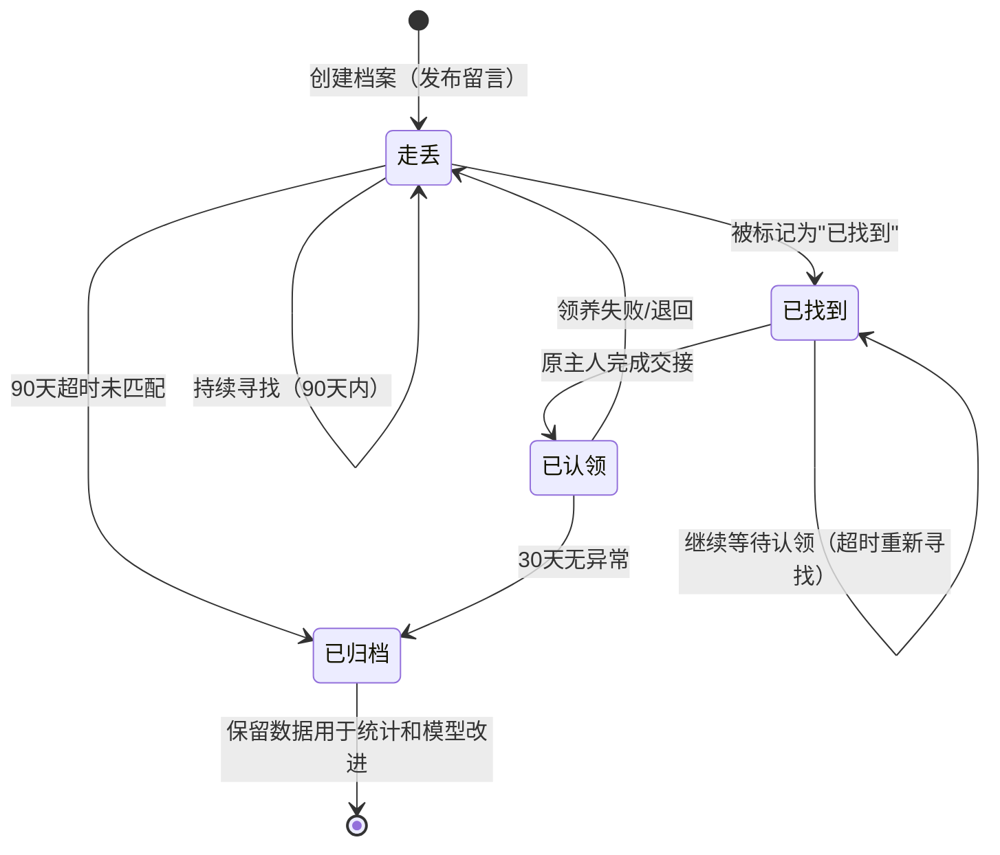

# 实体：动物记录

## 基本信息

> 动物记录是系统的核心实体，代表一只被记录的流浪动物的唯一身份档案。
> 与传统方案的区别：以**鼻纹特征向量**为核心身份标识，而非仅依赖外观照片。

## 数据结构

### 核心字段

| 字段名 | 类型 | 必填 | 说明 | 示例 |
|--------|------|------|------|------|
| `animal_id` | UUID | ✅ | 全局唯一标识 | `a1b2c3d4-...` |
| `status` | Enum | ✅ | 状态 | 见下方状态流转表 |
| `species` | Enum | ✅ | 物种：cat / dog / other | `dog` |
| `breed` | String | ❌ | 品种 | `中华田园犬` |
| `color` | String | ❌ | 毛色 | `黄白相间` |
| `gender` | Enum | ❌ | 性别：male / female / unknown | `male` |
| `age_estimate` | Enum | ❌ | 年龄段：puppy / adult / senior | `adult` |
| `health_status` | Enum | ❌ | 健康状态：healthy / injured / ill / unknown | `healthy` |
| `sterilized` | Boolean | ❌ | 是否绝育 | `false` |
| `first_seen_at` | DateTime | ✅ | 首次发现时间 | `2026-05-01` |
| `last_seen_at` | DateTime | ✅ | 最后出现时间 | `2026-05-04` |
| `location` | GeoPoint | ✅ | 最后发现位置（经纬度） | `{lat: 39.9, lng: 116.4}` |
| `address` | String | ❌ | 地址描述 | `朝阳区某公园` |
| `notes` | Text | ❌ | 备注（亲人程度、特殊标记等） | `项圈蓝色` |
| `tags` | Array[String] | ❌ | 自定义标签 | `["亲人", "已绝育"]` |
| `created_at` | DateTime | ✅ | 档案创建时间 | `2026-05-04` |
| `updated_at` | DateTime | ✅ | 最后更新时间 | `2026-05-04` |

### 鼻纹特征关联

| 关联字段 | 类型 | 说明 |
|----------|------|------|
| `nose_vector_id` | UUID | 关联 `鼻纹特征` 表，记录 128 维特征向量的唯一标识 |
| `nose_photo_url` | String | 鼻纹照片存储路径（用于二次比对） |
| `nose_landmark_data` | JSON | 鼻纹关键点标注数据（鼻框中心+鼻翼坐标） |
| `nose_confidence` | Float | 图片质量置信度（0-1），展示给用户参考 | `0.92` |

### 关系图

```
动物记录
    │
    ├──1:N── 救助事件（report / rescue / medical / adopt）
    │
    ├──1:1── 鼻纹特征（nose_vector_id 关联）
    │
    └──N:N── 认领记录（多次认领历史）
```

---

## 状态流转

> **核心状态**：`走丢 → 已找到 → 已认领 → 已归档`



### 状态说明

| 状态 | 说明 | 可流转条件 |
|------|------|-----------|
| **走丢**（默认） | 刚发布留言，等待救助 | 被标记为"已找到"，或 90 天超时 |
| **已找到** | 有人发现了这只动物，等待主人认领 | 原主人认领 → 已认领；超时 → 继续等待或归档 |
| **已认领** | 原主人与救助者完成交接 | 30 天无异常 → 已归档 |
| **已归档** | 历史记录，保留数据用于统计 | 不可流转，鼻纹向量保留用于模型改进 |

### 异常处理

| 情况 | 系统行为 |
|------|----------|
| 管理员发现留言信息虚假/恶意 | 直接删除，状态终止 |
| 多条留言指向同一动物 | AI 提示合并，用户/管理员确认后合并 |
| 原主人和救助者同时声称认领权 | 标记"争议中"，管理员人工判断 |
| 动物走丢 1 个月后找回，用户忘记关闭留言 | 90 天超时自动改为"超时未匹配"，用户可选择重发或关闭 |

---

## 索引策略

| 索引类型 | 用途 | 实现方式 |
|----------|------|----------|
| 向量索引 | 鼻纹相似度检索（核心） | Qdrant / Milvus / pgvector |
| GeoHash 索引 | 位置邻近查询 | PostGIS 或自定义 GeoHash |
| 外观索引 | 品种+毛色快速过滤 | B-Tree 组合索引 |
| 时间索引 | 按时间范围查询 | GIST 索引 |

---

## 数据来源

> 本页内容基于：
> - [[raw/参考资料/AI鼻纹救助系统_8周里程碑_v2.md]] — 基础字段定义
> - [[raw/参考资料/产品描述任务文档_v1.5.md]] — 状态流转规则（走丢→已找到→已认领→已归档）

## 相关概念

- [[wiki/概念/鼻纹识别]] — 如何提取鼻纹特征向量
- [[wiki/概念/四维度融合策略]] — 特征向量在融合策略中的权重（40%）
- [[wiki/实体/实体-鼻纹特征]] — 鼻纹特征向量存储结构
- [[wiki/实体/实体-救助事件]] — 动物的救助历史记录