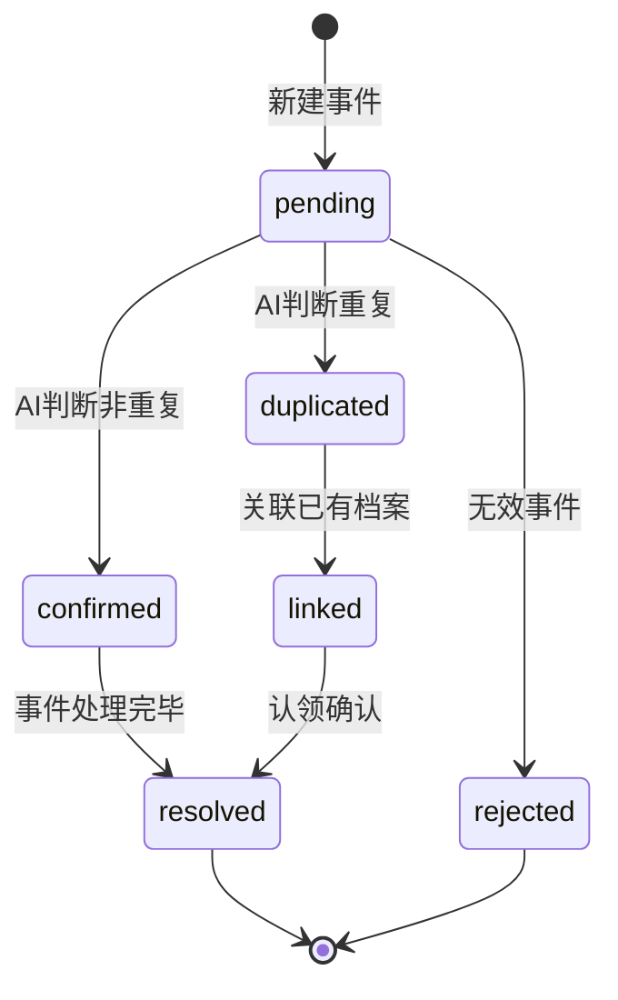

# 实体：救助事件

## 基本信息

> 救助事件记录每次动物被发现、上报、处理的完整操作历史，是系统的核心操作日志。

## 数据结构

### 核心字段

| 字段名 | 类型 | 必填 | 说明 | 示例 |
|--------|------|------|------|------|
| `event_id` | UUID | ✅ | 全局唯一标识 | `e5f6g7h8-...` |
| `animal_id` | UUID | ✅ | 关联的动物记录（null 表示新档案） | `a1b2c3d4-...` |
| `event_type` | Enum | ✅ | 事件类型 | 见下方类型表 |
| `reporter_id` | UUID | ✅ | 上报人 ID（关联用户表） | `u1a2b3c4-...` |
| `station_id` | UUID | ❌ | 关联救助站 ID | `s9x8y7z6-...` |
| `occurred_at` | DateTime | ✅ | 事件发生时间 | `2026-05-04 14:30` |
| `location` | GeoPoint | ✅ | 事件发生位置 | `{lat: 39.9, lng: 116.4}` |
| `address` | String | ❌ | 地址描述 | `朝阳区公园路` |
| `photos` | Array[URL] | ❌ | 本次事件的现场照片 | `["..."]` |
| `nose_photo_url` | String | ❌ | 本次采集的鼻纹照片 | `...` |
| `description` | Text | ❌ | 事件描述 | `发现时正在觅食` |
| `action_taken` | Text | ❌ | 已采取的行动 | `已送往救助站` |
| `is_duplicate` | Boolean | ✅ | 是否被判定为重复 | `false` |
| `duplicate_of` | UUID | ❌ | 重复关联的动物 ID | `a1b2c3d4-...` |
| `fusion_score` | Float | ❌ | 四维度融合综合得分（0-1） | `0.87` |
| `status` | Enum | ✅ | 状态 | 见状态流转 |

### 事件类型

| 类型 | 说明 | 典型场景 |
|------|------|----------|
| `report` | 市民/志愿者发现并上报 | 街道发现流浪猫 |
| `rescue` | 专业救助行动 | 诱捕后送往救助站 |
| `medical` | 医疗处理 | 伤口治疗、绝育手术 |
| `adopt` | 被领养 | 动物被家庭领养 |
| `transfer` | 转移 | 从 A 站转移到 B 站 |
| `release` | 放归 | 康复后原地放归 |

### 状态流转

---

## 与动物记录的关系

- **新事件**（`animal_id = null`）：用户上报时系统尚未匹配到现有档案，事件创建后触发 AI 比对流程
- **关联事件**（`animal_id` 有值）：系统已确认匹配到现有档案，事件关联到已有动物记录
- 事件记录是动物档案变更的完整历史
- `last_seen_at` 由最新事件的 `occurred_at` 更新

---

## 数据来源

> 本页内容基于：[[raw/参考资料/AI鼻纹救助系统_8周里程碑_v2.md]] + W2 数据库设计任务

## 相关概念

- [[wiki/实体/实体-动物记录]] — 事件所属的动物档案
- [[wiki/概念/四维度融合策略]] — `fusion_score` 的计算方式
- [[wiki/概念/鼻纹识别]] — 鼻纹采集与比对流程