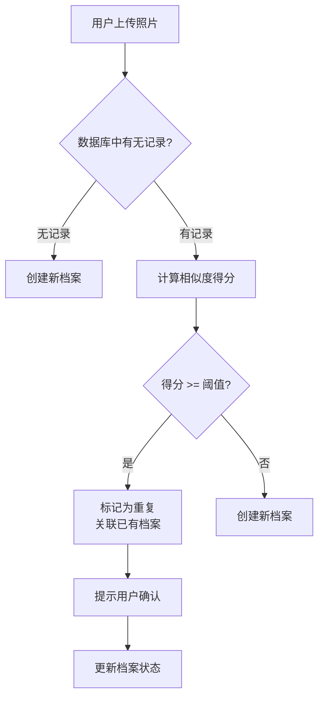

# 重复救助检测

## 核心要点

1. **定义**：当用户上报一只动物时，系统判断该动物是否已在数据库中存在对应档案
2. **触发时机**：用户提交新动物上报表单时
3. **核心挑战**：外观相似性判断受品种、毛色、拍照角度、光照条件影响大
4. **判断依据**：照片相似度 + 位置 + 时间 + 其他特征的多维度综合评估

## 详细说明

### 问题定义

重复救助分为两类：

| 类型 | 描述 | 示例 |
|------|------|------|
| **完全重复** | 同一只动物，同一时间被多人上报 | 同一只狗在公园被 A 和 B 同时发现 |
| **历史重复** | 同一只动物在不同时间被不同人上报 | 同一只猫一周前被上报，现在又被上报 |

### 检测流程

### 相似度阈值策略

- **高置信度**（> 0.9）：自动合并，无需人工确认
- **中置信度**（0.6-0.9）：提示用户确认
- **低置信度**（< 0.6）：视为新档案

> ⚠️ 阈值需根据实际数据调优，初期建议保守（提高召回率）

### 辅助判断特征

除照片外，综合以下特征提升准确率：

- **位置**：GPS 坐标是否在已知位置附近（需考虑动物活动范围）
- **时间**：两次上报时间间隔（同一地点短时间内重复概率高）
- **外观描述**：用户填写的品种、毛色、体型描述
- **标记物**：项圈、伤口疤痕等明显标记

## 数据来源

> 本页内容基于：[[wiki/overview]] + 待填充的 `raw/` 中的需求文档

## 相关概念

- [[wiki/概念/动物画像]] — 特征提取方式
- [[wiki/概念/相似度算法]] — 具体算法选型
- [[wiki/实体/实体-动物记录]] — 动物档案数据模型
- [[wiki/实体/实体-救助事件]] — 上报事件数据模型
