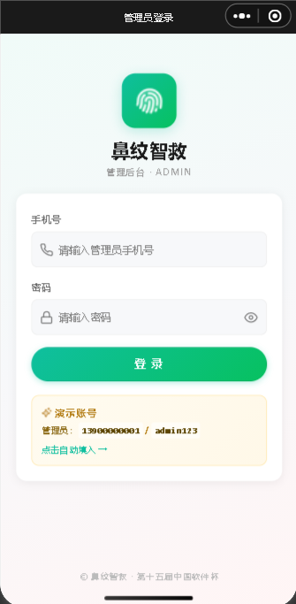
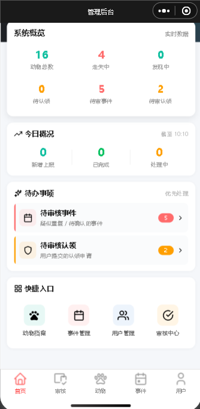
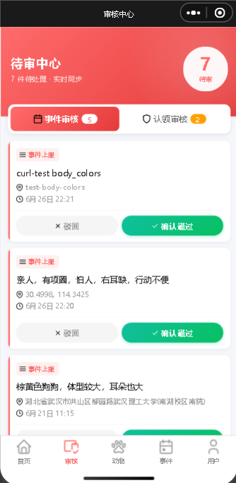
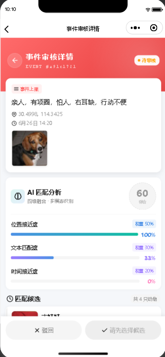
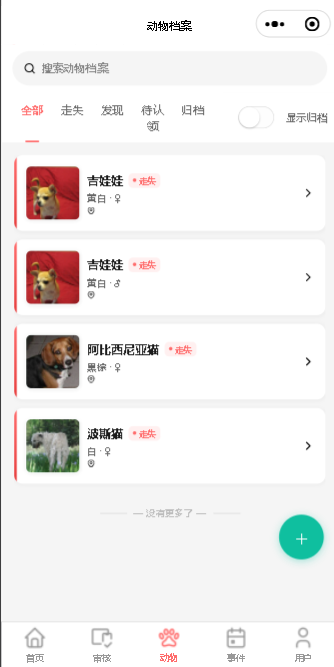
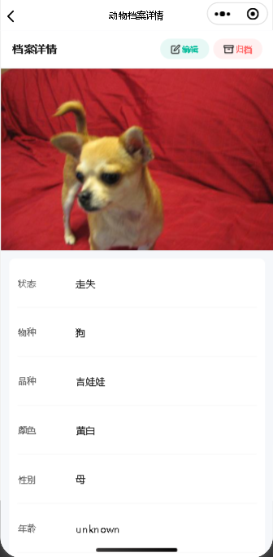
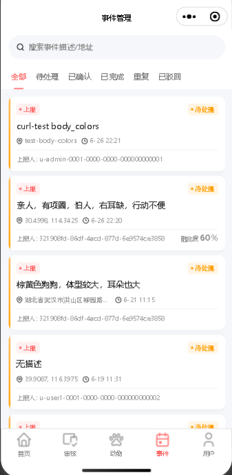
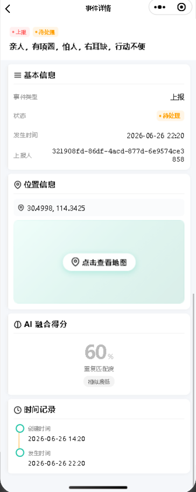
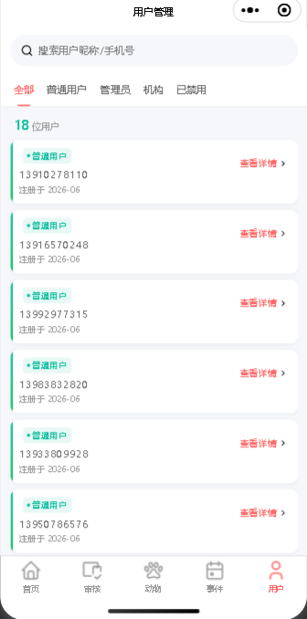
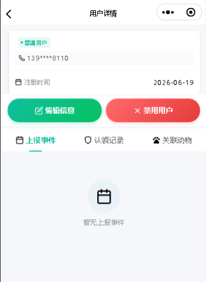

# 06-小程序 UI 设计稿 — 鼻纹智救

> **文档定位**：对应中国软件杯竞赛指南的"用户体验/界面设计"维度
> **代码引用规范**：每个页面都对应到 `F:\swcup2026\miniapp-user\src\pages\` 或 `miniapp-admin\src\pages\` 下的 `.vue` 文件
> **设计规范**：主题色 `#0FBF9F`（青绿）、辅助色 `#E8FDF8`（浅绿）、警告色 `#FF6B6B`（红）、中性灰 `#999999`（来源：`pages.json`）
> **文档版本**：v1.1（2026-07-07 锁定；v1.1 新增 intent 单选 / 评论页 / 时间轴页 / 双按钮 / 关联入口 / 线索看板）

---

## 0. 阅读导览

| 章节 | 内容                       | 页面/代码数         |
| ---- | -------------------------- | ------------------- |
| §1   | 设计原则与视觉规范         | 6 项原则            |
| §2   | 用户端 18 页面（v1.0 是 16，新增评论页 + 时间轴页） | 18 wireframe + 路径 |
| §3   | 管理端 12 页面             | 12 wireframe + 路径 |
| §4   | 5 个核心交互流程（v1.0 是 3，新增评论 + 时间轴） | 采集/上报/认领/评论/时间轴 |
| §5   | 设计系统（颜色/字体/组件） | tokens 速查         |
| §6   | 关键交互细节               | 弹窗/Loading/错误态 |
| §7   | 可访问性 & 性能            | 4 项实践            |

> **v1.1 新增概览**：用户端 +2 页面（评论组件 + 时间轴页），3 个已有页面改交互（采集页加 intent 单选 / 动物详情拆双按钮 / 我的上报加关联入口），管理端审核页加线索看板标签。

---

## 1. 设计原则与视觉规范

### 1.1 6 项设计原则

1. **首要任务显眼**：底部 tabBar 只放 3 个最高频入口（首页/发现/我的），其他功能放在二级页面。
2. **拍照入口明显**：鼻纹采集是核心任务，首页和"我的"页面都有浮窗按钮。
3. **结果即时反馈**：比对结果（采集/认领）必须 ≤ 1 秒展示 Loading，2 秒内出结果。
4. **错误可恢复**：模糊照片、GPS 失败、网络断开等都有明确重试入口。
5. **隐私明示**：上传图片前必须用户主动确认；隐私政策在登录前可访问。
6. **响应式布局**：uni-app 自带 rpx 单位（750rpx = 屏幕宽），适配 iPhone SE ~ iPhone 15 Pro Max。

### 1.2 主题色规范

| 用途                            | 色值              | 来源                                 |
| ------------------------------- | ----------------- | ------------------------------------ |
| **主色（品牌/CTA）**            | `#0FBF9F`         | `pages.json:64, 73, 82, 136`         |
| **辅助浅色（背景）**            | `#E8FDF8`         | `pages.json:16, 25, 35, 49, 58`      |
| **纯白（卡片/底色）**           | `#FFFFFF`         | `pages.json:7, 39, 87, 95, 103, 130` |
| **中性灰（次要文字/未选 tab）** | `#999999`         | `pages.json:135`                     |
| **警告色**                      | `#FF6B6B`（推断） | 错误态                               |
| **背景色（页面底）**            | `#F5F5F5`         | `pages.json:129`                     |

> **设计意图**：青绿色 (`#0FBF9F`) 兼具"医疗专业感"（医院常用绿）与"公益温暖感"（环保/动物保护常用），与"鼻纹智救"的救助主题契合。

### 1.3 字体规范

- **系统字体**（uni-app 默认）：iOS 苹方 / Android 思源黑体
- **标题**：18-20 px / 粗体
- **正文**：14-16 px / 常规
- **次要**：12 px / 灰色

---

## 2. 用户端 18 页面（v1.0 是 16）

> **代码位置**：`F:\swcup2026\miniapp-user\src\pages\`
> **入口配置**：`miniapp-user/src/pages.json`

### 2.1 首页 `pages/index/index.vue`（tabBar 首页）

```
┌──────────────────────────────┐
│  ←  鼻纹智救              🔍 │  ← 导航栏（白底黑字）
├──────────────────────────────┤
│  [Banner 轮播图 3 张]        │  ← 救助故事 / 平台公告
│                              │
├──────────────────────────────┤
│  ┌────────────┐ ┌──────────┐ │  ← 2×2 快捷入口
│  │ 📷 鼻纹采集 │ │ 📍 发现  │ │
│  └────────────┘ └──────────┘ │
│  ┌────────────┐ ┌──────────┐ │
│  │ 🐾 认领申请 │ │ 📋 我的  │ │
│  └────────────┘ └──────────┘ │
│                              │
│  ── 平台数据 ──             │
│  已救助 1,234 只 · 1,890 志愿者│  ← 实时统计
│                              │
├──────────────────────────────┤
│  🏠 首页  📍 发现  👤 我的   │  ← tabBar
└──────────────────────────────┘
```

**交互细节**：

- Banner 支持手动滑动 + 3 秒自动切换
- 2×2 入口图标，点击跳转对应页面
- 底部统计数据每 30 秒刷新一次

### 2.2 登录 `pages/login/index.vue`

```
┌──────────────────────────────┐
│  ←  登录（浅绿 bar #E8FDF8）  │
├──────────────────────────────┤
│                              │
│         🐾 鼻纹智救           │  ← Logo
│       让每只狗不再被重复救助   │  ← Slogan
│                              │
│  ┌──────────────────────┐   │
│  │ 📱 请输入手机号       │   │  ← 输入框
│  └──────────────────────┘   │
│  ┌──────────────────────┐   │
│  │ 🔒 请输入密码    👁   │   │
│  └──────────────────────┘   │
│                              │
│  ┌──────────────────────┐   │
│  │      登录（绿色）    │   │  ← CTA
│  └──────────────────────┘   │
│                              │
│  忘记密码？   微信登录   注册新账号 │
│                              │
└──────────────────────────────┘
```

**关键交互**：

- "微信登录"按钮调 `wx.login()` → 后端 `POST /v1/auth/weixin`（`auth.controller.ts`）
- "忘记密码"跳转 `pages/login/reset-password/index`
- "注册新账号"跳转 `pages/register/index`

### 2.3 注册 `pages/register/index.vue`

```
┌──────────────────────────────┐
│  ←  注册（浅绿 bar）         │
├──────────────────────────────┤
│  ┌──────────────────────┐   │
│  │ 📱 手机号             │   │
│  └──────────────────────┘   │
│  ┌──────────┐ ┌────────┐   │
│  │ 验证码    │ │ 获取    │   │  ← 60 秒倒计时
│  └──────────┘ └────────┘   │
│  ┌──────────────────────┐   │
│  │ 🔒 设置密码    👁     │   │
│  └──────────────────────┘   │
│  ┌──────────────────────┐   │
│  │ 🔒 确认密码    👁     │   │
│  └──────────────────────┘   │
│                              │
│  ☑ 我已阅读并同意《用户协议》│  ← 必勾
│     与《隐私政策》            │
│                              │
│  ┌──────────────────────┐   │
│  │      注册（绿色）    │   │
│  └──────────────────────┘   │
└──────────────────────────────┘
```

### 2.4 重置密码 `pages/login/reset-password/index.vue`

同注册页结构，仅文案不同。

### 2.5 隐私政策 `pages/privacy/index.vue`

纯文本展示页，从后端或静态文件加载隐私政策全文。

### 2.6 完善资料 `pages/profile/complete/index.vue`

```
┌──────────────────────────────┐
│  ←  完善资料                  │
├──────────────────────────────┤
│  头像：[+ 添加]               │  ← 微信头像 or 默认
│                              │
│  昵称：[____________]        │
│  地区：[北京 朝阳区 ▼]        │  ← uni-app picker
│  个人简介：[_______________]  │
│                              │
│  ┌──────────────────────┐   │
│  │      保存            │   │
│  └──────────────────────┘   │
└──────────────────────────────┘
```

### 2.7 绑定手机 `pages/profile/bind/index.vue`

```
┌──────────────────────────────┐
│  ←  绑定手机                  │
├──────────────────────────────┤
│  ┌──────────────────────┐   │
│  │ 📱 请输入手机号       │   │
│  └──────────────────────┘   │
│  ┌──────────┐ ┌────────┐   │
│  │ 验证码    │ │ 获取    │   │
│  └──────────┘ └────────┘   │
│                              │
│  ┌──────────────────────┐   │
│  │      确认绑定        │   │
│  └──────────────────────┘   │
└──────────────────────────────┘
```

### 2.8 鼻纹采集 `pages/collect/index.vue` ⭐ 核心页面

```
┌──────────────────────────────┐
│  ←  鼻纹采集（绿 bar #0FBF9F）│
├──────────────────────────────┤
│  拍摄小贴士：                 │
│  · 距离鼻子 10-15 cm          │
│  · 室内或光线充足              │
│  · 鼻子居中、对焦清晰          │
│                              │
│  ┌──────────────────────┐   │
│  │                      │   │
│  │   [相机预览区]        │   │  ← uni-app camera 组件
│  │                      │   │
│  │   ⊙ 圆形对准框       │   │  ← 引导用户对准
│  │                      │   │
│  └──────────────────────┘   │
│                              │
│  实时质量评分：92 分 ✓       │  ← 调 /v1/nose/detect
│                              │
│  ┌──────────────────────┐   │
│  │   📷 拍照（绿色大按钮）│   │
│  └──────────────────────┘   │
│                              │
│  ┌─ 你的救助目的是 ────────┐ │  ← v1.1 新增 intent 单选
│  │ ◉ 我要认领/寻找丢失的    │ │
│  │ ○ 我捡到了/想建档        │ │  ← intent: lost / found
│  └────────────────────────┘ │
│                              │
│  当前位置：[北京朝阳区] 📍    │  ← 调 wx.getLocation
└──────────────────────────────┘
```

**关键交互**（v1.1 更新，6 步）：

1. 用户进入页面 → 调 `wx.getLocation()` 拿 GPS
2. 相机实时预览 → 每秒 1 次调 `POST /v1/nose/detect` 检测清晰度
3. 评分 ≥ 70 才允许点击"拍照"
4. 拍照后 → 调 `POST /v1/nose/extract` 拿向量
5. **v1.1 新增**：用户选 intent（`lost` / `found`），其它意图（`stray_sighting` / `profile_build` / `unknown`）需走"我又看到这只"路径
6. 调 `POST /v1/nose/events/collect` 完成比对（intent 透传到 DTO，`Animal.status` 由 intent 派生：`found` → `FOUND`，其余 → `LOST`）
7. 跳转 `pages/collect/result`

### 2.9 采集结果 `pages/collect/result.vue` ⭐ 核心页面

```
┌──────────────────────────────┐
│  ←  比对结果（绿 bar）        │
├──────────────────────────────┤
│  ✓ 已找到这只狗              │  ← next_action 决定文案
│                              │
│  ┌──────────────────────┐   │
│  │    [档案照片]         │   │
│  │                      │   │
│  │    🐕 柴犬 · 公       │   │
│  │    ID: ANM-2026-0012 │   │
│  └──────────────────────┘   │
│                              │
│  相似度评分                   │
│  ┌──────────────────────┐   │
│  │  向量相似度  ▓▓▓▓░ 92%│   │
│  │  GPS 距离    ▓▓░░░ 280m│   │
│  │  文本匹配    ▓▓▓░░ 75%│   │
│  │  综合分      ▓▓▓▓░ 88%│   │  ← fusion_score
│  └──────────────────────┘   │
│                              │
│  历史救助记录（3 条）         │
│  ┌──────────────────────┐   │
│  │  2026-05-10 朝阳救助站│   │
│  │  2026-04-22 朝阳救助站│   │
│  │  2026-03-15 通州救助站│   │
│  └──────────────────────┘   │
│                              │
│  ┌──────────────────────┐   │
│  │   立即认领（绿色）    │   │  ← 跳 pages/claim
│  └──────────────────────┘   │
└──────────────────────────────┘
```

**3 种结果分支**（由后端 `next_action` 决定）：

- `ask_claim_or_new`（融合分 ≥ 0.88）：显示"已找到"，主按钮"立即认领"
- `ask_claim_existing`（0.75-0.88）：显示"可能是这只狗，请确认"
- `ask_link_or_new` / `ask_user_create`（< 0.75）：显示"未找到档案，是否新建"

### 2.10 发现上报 `pages/report/index.vue` ⭐ 核心页面

```
┌──────────────────────────────┐
│  ←  发现上报（绿 bar）        │
├──────────────────────────────┤
│  看到流浪动物？上报帮它找档案 │
│                              │
│  ┌──────────────────────┐   │
│  │   [拍照 / 从相册选]    │   │  ← 可选，非强制
│  └──────────────────────┘   │
│                              │
│  品种：[柴犬 ▼]              │
│  性别：[♂ 公 / ♀母 / 不确定] │
│  体型：[小型 ▼]              │
│  毛色：[黄色 ▼]              │
│  耳型：[立耳 ▼]              │
│  尾型：[卷尾 ▼]              │
│  发现地点：[北京朝阳区] 📍    │
│  详细位置：[____________]    │
│  备注：[_________________]   │
│                              │
│  ┌──────────────────────┐   │
│  │      提交上报        │   │
│  └──────────────────────┘   │
└──────────────────────────────┘
```

**关键交互**：

- 表单字段直接映射到 `nose-text-match.ts` 的 7 个匹配维度
- 提交 → `POST /v1/nose/events/report` → 调 `MatchingService`
- 跳转"我的上报"页

### 2.11 动物详情 `pages/animal-detail/index.vue`

```
┌──────────────────────────────┐
│  ←  动物详情                  │
├──────────────────────────────┤
│  [档案大图 + 鼻纹特写轮播]    │
│                              │
│  🐕 柴犬 · 公 · 2 岁         │
│  体重：8 kg                  │
│  健康：已绝育 ✓              │
│  状态：寻找领养               │
│                              │
│  ── 救助记录 ──              │
│  ┌──────────────────────┐   │
│  │ 2026-05-10 朝阳救助站 │   │
│  │  救助人：李*           │   │
│  │ 2026-04-22 通州救助站 │   │
│  │  救助人：王**          │   │
│  └──────────────────────┘   │
│                              │
│  ── 评论(12) ──              │  ← v1.1 新增评论区
│  ┌──────────────────────┐   │
│  │ 小明：好可怜，希望...   │   │
│  │ 志愿者张：朝阳公园...  │   │
│  │ [查看全部 →]            │   │
│  └──────────────────────┘   │
│                              │
│  [查看完整时间轴 →]           │  ← v1.1 新增入口
│                              │
│  ┌──────────────┐ ┌────────┐│  ← v1.1 拆双按钮
│  │ 👁 我又看到这只│ │🐾申请认领│ │
│  └──────────────┘ └────────┘│
└──────────────────────────────┘
```

**v1.1 改动**：
- **拆双按钮**：原"申请认领"拆为"我又看到这只"（走 `POST /v1/events/:id/link` 用户自助关联，intent=`stray_sighting`）+"申请认领"（走 `pages/claim`）。两按钮宽度各 50% 并排显示。
- **评论预览**：展示最近 3 条评论 + 总条数，"查看全部"跳 `pages/animal-detail/comments.vue`（§2.16）。
- **时间轴入口**："查看完整时间轴"跳 `pages/animal-detail/timeline.vue`（§2.17）。
- **状态联动**：动物 `status ∈ {claimed, archived}` 时按钮置灰 + 提示"已认领/已归档，禁止评论"。
- **评论输入**：底部固定"说点什么…"输入栏，提交后调 `POST /v1/comments`，AI 审核 L0~L4 + 60s 去重（基线 #35）。

### 2.12 认领申请 `pages/claim/index.vue`

```
┌──────────────────────────────┐
│  ←  认领申请                  │
├──────────────────────────────┤
│  申请认领：柴犬 ANM-2026-0012│
│                              │
│  申请人信息                   │
│  姓名：[____________]        │
│  身份证：[____________]       │
│  居住城市：[北京 ▼]          │
│  详细地址：[____________]    │
│  养宠经验：[10 年 ▼]        │
│                              │
│  养宠环境照片（可选）         │
│  ┌───┐ ┌───┐ ┌────┐        │
│  │ + │ │图1│ │图2 │         │
│  └───┘ └───┘ └────┘        │
│                              │
│  申请理由：[_______________] │
│                              │
│  ┌──────────────────────┐   │
│  │   提交申请            │   │
│  └──────────────────────┘   │
└──────────────────────────────┘
```

### 2.13 个人中心 `pages/user/index.vue`（tabBar 我的）

```
┌──────────────────────────────┐
│  ←  个人中心                  │
├──────────────────────────────┤
│  ┌──────────────────────┐   │
│  │  [头像]  昵称         │   │  ← 用户信息卡
│  │           📱 138****5678│   │
│  └──────────────────────┘   │
│                              │
│  ┌──────────────────────┐   │
│  │ 📋 我的上报            ─→│   │
│  │ 🐾 认领记录            ─→│   │
│  │ 🔐 修改密码            ─→│   │
│  │ ⚙️ 设置                ─→│   │
│  │ 📜 隐私政策            ─→│   │
│  │ ℹ️ 关于我们            ─→│   │
│  └──────────────────────┘   │
│                              │
│  [退出登录（灰色文字按钮）]   │
└──────────────────────────────┘
```

### 2.14 我的上报 `pages/my-reports/index.vue`

```
┌──────────────────────────────┐
│  ←  我的上报                  │
├──────────────────────────────┤
│  筛选：[全部 ▼] [待确认 ▼]    │
│                              │
│  ┌──────────────────────┐   │
│  │ [缩略图] 柴犬 · 朝阳   │   │
│  │           2026-06-10  │   │
│  │           ✓ 已确认     │   │
│  │  [🔗 关联到动物] (灰)  │   │  ← 已关联事件按钮置灰
│  └──────────────────────┘   │
│  ┌──────────────────────┐   │
│  │ [缩略图] 田园犬 · 通州 │   │
│  │           2026-06-08  │   │
│  │           ⏳ 待审核     │   │
│  │  [🔗 关联到动物]       │   │  ← v1.1 新增入口
│  └──────────────────────┘   │
└──────────────────────────────┘
```

**v1.1 改动**：
- 新增"关联到动物"按钮，仅当 `event.status='pending'` 且 `animal_id IS NULL` 时显示
- 点击弹出动物选择器（搜索框 + 列表），选中后调 `POST /v1/events/:event_id/link`
- 后端走 admin 二次确认：`event.status='linked'`（基线 #31）

### 2.15 认领记录 `pages/my-claims/index.vue`

同"我的上报"结构，字段是认领记录。

### 2.16 评论列表 `pages/animal-detail/comments.vue`（v1.1 新增）

```
┌──────────────────────────────┐
│  ←  评论（共 23 条）           │
├──────────────────────────────┤
│  [情感分布：关爱 12 | 寻主 3   │  ← v1.1 新增 AI 摘要
│   | 目击 5 | 致谢 2 | 中性 1]   │
│                              │
│  ┌──────────────────────┐   │
│  │ 😊 小明 · 朝阳        │   │  ← sentiment=care
│  │ 好可怜，希望它能...    │   │
│  │ 2026-07-06 12:34     │   │
│  └──────────────────────┘   │
│  ┌──────────────────────┐   │
│  │ 🔍 志愿者张 · 通州    │   │  ← sentiment=seek
│  │ 在通州万达附近看到...   │   │
│  │ 2026-07-05 18:22     │   │
│  └──────────────────────┘   │
│  ┌──────────────────────┐   │
│  │ 👁 李同学 · 朝阳       │   │  ← sentiment=report
│  │ 今天又在朝阳公园看到... │   │
│  │ 2026-07-05 09:10     │   │
│  └──────────────────────┘   │
│                              │
│  ┌──────────────────────┐   │  ← 固定底部输入栏
│  │ 说点什么…    📷 发送   │   │
│  └──────────────────────┘   │
└──────────────────────────────┘
```

**v1.1 新增页面**：
- 顶部情感分布摘要：调 `GET /v1/comments/animal/:animal_id/summary`，按 6 类情感分桶统计（基线 #35）
- 评论列表按 `created_at` 倒序，每条显示情感图标 + 昵称 + 内容 + 时间
- `is_hidden=true` 评论 owner/admin 可见，普通用户不可见
- 底部输入栏：调 `POST /v1/comments`，触发 moderate（§11.2 of 05 报告）的 L0~L4 分级
  - L0 正常 → 立即入库并显示
  - L1/L2 → 显示"评论已提交，审核中"
  - L3/L4 → 弹窗"评论包含违规内容，请修改"

### 2.17 时间轴 `pages/animal-detail/timeline.vue`（v1.1 新增）

```
┌──────────────────────────────┐
│  ←  柴犬 ANM-2026-0012 时间轴 │
├──────────────────────────────┤
│                              │
│  ●  2026-07-06 12:34         │  ← 评论事件（绿）
│  │  小明：好可怜...           │
│  │                            │
│  ├  2026-07-05 18:22         │  ← 目击上报（橙）
│  │  志愿者张：通州万达看到    │
│  │                            │
│  ├  2026-07-05 09:10         │  ← 救助事件（蓝）
│  │  救助人李*：已驱虫+疫苗    │
│  │                            │
│  ├  2026-06-10 14:22         │  ← 建档事件（紫）
│  │  创建档案：金毛/田园犬     │
│  │                            │
│  ├  2026-05-30 10:00         │  ← 鼻纹采集（青）
│  │  采集鼻纹照片 4 张         │
│                              │
└──────────────────────────────┘
```

**v1.1 新增页面**：
- 调 `GET /v1/animals/:animal_id/timeline`，按 `occurred_at` 倒序
- 5 类事件用颜色区分：评论（绿）/ 上报（橙）/ 救助（蓝）/ 建档（紫）/ 鼻纹采集（青）
- 点击任一条目跳详情页（评论→评论详情，事件→事件详情）
- 时间轴底部"返回档案"按钮回到 §2.11 动物详情

---

## 3. 管理端 12 页面

> **代码位置**：`F:\swcup2026\miniapp-admin\src\pages\`

### 3.1 管理端登录 `pages/login/login.vue`



> 仅 `admin` 角色可登录（JWT 验证 `role === 'admin'`，`auth.service.ts`）。

### 3.2 管理首页 `pages/admin/index.vue`



### 3.3 审核中心 `pages/admin/audit/index.vue`



**v1.1 新增**：审核中心顶部 tab 栏新增"线索看板"标签，列表展示 `pending` 状态的跨模型线索（来自评论 AI 的 `clue_matcher.py`）。

```
[待审事件 (12)] [线索看板 (3)] [已处理 (45)]   ← v1.1 新增 tab
─────────────────────────
线索 #1
┌─────────────────────────────────────┐
│  评论：朝阳公园又看到那只金毛了，     │
│        脖子上有红项圈                │
│  匹配档案：柴犬 ANM-2026-0012        │
│  匹配分：0.82（词典命中：红项圈/朝阳）│
│  [✓ 确认关联]  [✗ 拒绝]             │  ← 调 /v1/admin/clues/:a/:m/decide
└─────────────────────────────────────┘
线索 #2 ...
```

- 数据源：`GET /v1/admin/clues/pending`（基线 #33 新增端点）
- 决策动作：`POST /v1/admin/clues/:animal_id/:match_id/decide`，decision ∈ {confirm, reject}
- 确认后：comment 自动绑定 `animal_id`；拒绝后：comment 仅标记为已审视不关联

### 3.4 审核详情 `pages/admin/audit-detail/index.vue`



### 3.5 动物列表 `pages/animals/index.vue`



### 3.6 动物表单 `pages/animals/components/AnimalForm.vue`



### 3.7 动物详情 `pages/animals/detail/index.vue`

展示动物档案的完整信息（与用户端动物详情页类似，但多了管理操作：编辑/删除）。

### 3.8 事件列表 `pages/events/index.vue`



### 3.9 事件详情 `pages/events/detail/index.vue`



### 3.10 用户列表 `pages/users/index.vue`



### 3.11 用户详情 `pages/users/detail/index.vue`

## 

## 4. 5 个核心交互流程（v1.0 是 3，新增评论流程 + 时间轴流程）

### 4.1 流程 1：鼻纹采集全流程

```
┌──────────┐
│ 首页      │
│ 点击"鼻纹" │
└────┬─────┘
     ▼
┌──────────┐  无相机权限  ┌──────────┐
│ 采集页    │ ──────────→ │ 申请权限  │
│ camera    │ ←────────── │ 重试     │
└────┬─────┘ 用户授权     └──────────┘
     ▼
┌──────────┐  GPS 失败    ┌──────────┐
│ 取 GPS    │ ──────────→ │ 手动输入  │
│           │ ←────────── │          │
└────┬─────┘             └──────────┘
     ▼
┌──────────┐  模糊 < 70 分 ┌──────────┐
│ 实时评分  │ ───────────→ │ 提示重拍  │
│ /detect   │ ←─────────── │          │
└────┬─────┘              └──────────┘
     ▼ 评分 ≥ 70
┌──────────┐
│ 用户拍照  │
└────┬─────┘
     ▼
┌──────────┐  Loading 1-2s
│ /extract │ ←─── ⏳ ───┐
│ 取向量    │             │
└────┬─────┘             │
     ▼                   │
┌──────────┐             │
│ /compare │             │  ← 旋转动画
│ 比对候选  │             │
└────┬─────┘             │
     ▼                   │
┌──────────┐             │
│ /events/ │             │
│ collect  │ ────────────┘
└────┬─────┘
     ▼
┌──────────────────────┐
│ 结果页                 │
│ · ≥0.88 → 立即认领    │
│ · 0.75-0.88 → 是否这只│
│ · <0.75 → 新建档案    │
└──────────────────────┘
```

### 4.2 流程 2：目击上报全流程

```
┌──────────┐
│ tabBar 发现 │
└────┬─────┘
     ▼
┌──────────┐
│ 填表 7 字段 │
│ + 可选拍照 │
└────┬─────┘
     ▼
┌──────────┐
│ 提交 →     │
│ /events/  │
│ report    │
└────┬─────┘
     ▼
┌──────────────────────┐
│ MatchingService 匹配 │
│ GPS + 文本 + 时间衰减 │
└────┬─────┘
     ▼
┌──────────────────────┐
│ 弹"找到疑似"对话框    │
│ · 是 → 跳转详情       │
│ · 否 → 创建新档案     │
└──────────────────────┘
```

### 4.3 流程 3：认领审核流程

```
┌──────────┐         ┌──────────┐         ┌──────────┐
│ 用户提交  │ ──────→ │ 后端落库  │ ──────→ │ 待审列表  │
│ claim    │         │ status=  │         │ admin    │
│          │         │ pending  │         │ audit    │
└──────────┘         └──────────┘         └────┬─────┘
                                               ▼
                                        ┌──────────┐
                                        │ admin 审核 │
                                        │ confirm   │
                                        │ /reject   │
                                        └────┬─────┘
                                             ▼
                  ┌──────────────────────┐
                  │ 通过 → animal.status │
                  │      = claimed      │
                  │      claim.status=  │
                  │      approved       │
                  │ 拒绝 → claim.status │
                  │      = rejected     │
                  └──────────────────────┘
```

---

## 5. 设计系统（Design Tokens）

### 5.1 颜色 Token

| Token                    | 值        | 用途                            |
| ------------------------ | --------- | ------------------------------- |
| `--color-primary`        | `#0FBF9F` | 主 CTA、tabBar 选中、采集页 bar |
| `--color-primary-light`  | `#E8FDF8` | 浅色 bar、辅助背景              |
| `--color-white`          | `#FFFFFF` | 卡片、底色                      |
| `--color-bg`             | `#F5F5F5` | 页面底色                        |
| `--color-text`           | `#333333` | 主文字                          |
| `--color-text-secondary` | `#999999` | 次要文字、未选 tab              |
| `--color-success`        | `#52C41A` | 成功提示                        |
| `--color-warning`        | `#FAAD14` | 警告                            |
| `--color-error`          | `#FF6B6B` | 错误                            |

### 5.2 间距 Token

| Token        | 值（rpx） | 用途     |
| ------------ | --------- | -------- |
| `--space-xs` | 8         | 紧凑     |
| `--space-sm` | 16        | 段落     |
| `--space-md` | 24        | 卡片间距 |
| `--space-lg` | 32        | 页面边距 |
| `--space-xl` | 48        | 区块间隔 |

### 5.3 字号 Token

| Token        | 值（px） | 用途   |
| ------------ | -------- | ------ |
| `--font-xs`  | 12       | 次要   |
| `--font-sm`  | 14       | 辅助   |
| `--font-md`  | 16       | 正文   |
| `--font-lg`  | 18       | 小标题 |
| `--font-xl`  | 20       | 标题   |
| `--font-xxl` | 24       | 大标题 |

### 5.4 圆角 Token

| Token         | 值（rpx） | 用途   |
| ------------- | --------- | ------ |
| `--radius-sm` | 8         | 按钮   |
| `--radius-md` | 16        | 卡片   |
| `--radius-lg` | 24        | 大卡片 |

---

## 6. 关键交互细节

### 6.1 Loading 态

| 场景         | Loading 样式      | 文案                |
| ------------ | ----------------- | ------------------- |
| 鼻纹向量提取 | 全屏旋转 + 进度环 | "AI 识别中... 0.3s" |
| 比对候选     | 全屏旋转          | "正在比对... 1.2s"  |
| 提交上报     | 按钮内嵌 spinner  | "提交中..."         |
| 上传图片     | 进度条            | "上传 30%"          |

> **设计意图**：让用户**明确感知**响应时间，避免重复点击。

### 6.2 错误态

| 错误           | UI 表现                   | 重试入口       |
| -------------- | ------------------------- | -------------- |
| 网络断开       | 全屏红色图标 + "网络异常" | "重试"按钮     |
| 401 token 过期 | Toast "登录已过期"        | 自动跳登录页   |
| 403 权限不足   | Toast "您没有权限"        | -              |
| 拍照失败       | Toast "拍照失败，请重试"  | 自动重试       |
| GPS 失败       | Toast "无法获取位置"      | "手动选择"按钮 |
| 模糊照片       | 弹窗 "照片不清晰，请重拍" | "重新拍照"按钮 |
| 服务器 500     | Toast "服务异常，请稍后"  | "联系客服"按钮 |

### 6.3 空状态

| 页面     | 空状态                                   |
| -------- | ---------------------------------------- |
| 我的上报 | "暂无上报记录，点击 [发现] 上报第一只吧" |
| 认领记录 | "暂无认领记录"                           |
| 搜索结果 | "未找到符合条件的档案"                   |

---

## 7. 可访问性 & 性能

### 7.1 4 项可访问性实践

1. **按钮最小点击区域 88 × 88 rpx**（苹果 HIG 推荐）
2. **文字与背景对比度 ≥ 4.5:1**（WCAG AA）
3. **重要操作有震动反馈**（`wx.vibrateShort`）
4. **支持深色模式**（uni-app 媒体查询，自动适配）

### 7.2 3 项性能优化

1. **图片懒加载**：列表页用 `lazy-load` 指令
2. **按需引入组件**：uni-app easycom 自动按需
3. **分包加载**：用户端主包 < 2 MB（满足小程序限制）

---

## 附录 A：所有页面文件清单

### 用户端（18 个，v1.0 是 16）

```
miniapp-user/src/pages/
├── index/index.vue                     # 首页（tabBar）
├── login/
│   ├── index.vue                       # 登录
│   └── reset-password/index.vue        # 重置密码
├── register/index.vue                  # 注册
├── privacy/index.vue                   # 隐私政策
├── profile/
│   ├── complete/index.vue              # 完善资料
│   └── bind/index.vue                  # 绑定手机
├── collect/
│   ├── index.vue                       # 鼻纹采集 ⭐
│   └── result.vue                      # 比对结果 ⭐
├── report/index.vue                    # 发现上报 ⭐
├── animal-detail/
│   ├── index.vue                       # 动物详情（v1.1 拆双按钮 + 评论/时间轴入口）
│   ├── comments.vue                    # 评论列表（v1.1 新增）
│   └── timeline.vue                    # 时间轴（v1.1 新增）
├── claim/index.vue                     # 认领申请
├── user/index.vue                      # 个人中心（tabBar）
├── my-reports/index.vue                # 我的上报（v1.1 加"关联到动物"入口）
└── my-claims/index.vue                 # 认领记录
```

### 管理端（12 个）

```
miniapp-admin/src/pages/
├── login/login.vue                     # 管理端登录
├── admin/
│   ├── index.vue                       # 管理首页
│   ├── audit/index.vue                 # 审核列表 ⭐
│   └── audit-detail/index.vue          # 审核详情 ⭐
├── animals/
│   ├── index.vue                       # 动物列表
│   ├── components/AnimalForm.vue       # 动物表单
│   └── detail/index.vue                # 动物详情
├── events/
│   ├── index.vue                       # 事件列表
│   └── detail/index.vue                # 事件详情
└── users/
    ├── index.vue                       # 用户列表
    └── detail/index.vue                # 用户详情
```

---

**UI 设计稿结束。所有页面 wireframe 与实际 `.vue` 文件一一对应；3 个核心流程可直接对照 [02-架构设计.md](02-架构设计.md) §6 的时序图。**
